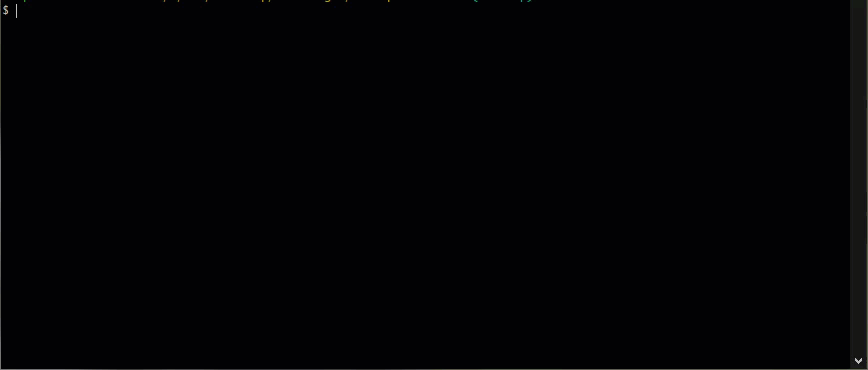

# Express Notes
A note-taking app that leverages the capabilities of express.js

This app was made as part of the University of Sydney and edX Bootcamp, it hosts a simple web-based interface pre-supplied with routes pre-defined, to get, create, and delete notes from a data source.

The motivation for this project is to apply skills learned in regards to express.js to create an app that successfully handles GET, POST, and DELETE requests using modular routing. It also provided a unique challenge in figuring out how to create a test suite that works with this type of application.

Perhaps the hardest part of this was wrangling with the testing suite. There's a few areas that could have been done better (like directly testing the functions in the notes.js file), but it was difficult to conceptualise how it was all going to work, and in the end I admittedly monkey-wrenched both the code and the tests to make it come half way. It's given me some food for thought for my next project.

I would also like to implement a more asynchronous approach, but I feel like this might be better suited for SQL databases instead, since it's likely multiple async writes to a file will cause conflicts.

## Table of Contents
- [Installation](#installation)
- [Usage](#usage)
- [Tests](#tests)
- [Credits](#credits)
- [License](#license)

## Installation
To use this project, clone the git repository locally and run `npm install` to obtain the required modules.

Once installed, use `npm start` to launch the Express.js webserver. It will default to using `http://localhost:3001` if you do not have a configured PORT value in process.env.

From there, you can access the app by going to your browser and entering the above address.

You may alternately access an [online version](https://whispering-savannah-85437-26ae402a31fe.herokuapp.com/) of this app here.

## Usage
To use the app, either after installing or going to the provided online:

- Click the "Get Started" link to bring up the main app screen
- If there are notes already present, then you will see them populate the list on the left side. Click any of the notes to load their content.
- You can also delete notes by clicking the trashcan icon
- Create a new note by clicking the "New Note" button at the top right
- Type in the title and text of your note, then click "Save Note" to store to the list
- Click "Clear Form" if you wish to remove the text already there

You can see a demonstration of the app in action below:



## Tests
The following test suites have been provided for the app, and evaluates the routes and whether they return appropriate responses to requests.

There are two modes of testing available:
- Standard testing mode

    Runs all tests normally

    ```
    npm start test
    ```

- Open handle checking
    
    Used to identify any tests that may be causing jest to hang (shouldn't be necessary with the separation of the listener fromm the main app, but there just in case)

    ```
    npm start check-handles
    ```

The test suite includes the following tests
- Express.js
    - Public Routes
        - root (/) returns public/index.html
        - notes (/notes) returns public/notes.html
    - API Routes
        - GET /api/notes exists
        - GET /api/notes/:id exists
        - POST /api/notes exists
        - DELETE /api/notes/:id exists
- Notes API
    - /api/notes returns an array of notes
    - /api/notes/:id returns a specific note
    - /api/notes/:id returns an error when an invalid param is passed
    - /api/notes adds a new note
    - /api/notes rejects notes with no body/content
    - /api/notes/:id deletes the specified note
    - /api/notes/:id returns an error when an invalid param is passed

The following GIF demonstrates these tests being executed and passed.


## Credits
### Code and Extensibility
- Testing suite: [jest](https://github.com/jestjs/jest)
- Testing extension for Express.js: [supertest](https://www.npmjs.com/package/supertest)
- Platform: [Node.js](https://nodejs.org/en)
### References
- How to perform unit testing on Express.js using Jest: [FEK.IO](https://fek.io/blog/how-to-add-unit-testing-to-express-using-jest)
### Misc
- Starter code provided by University of Sydney and edX

## License
This project is provided under the [MIT License](./LICENSE)